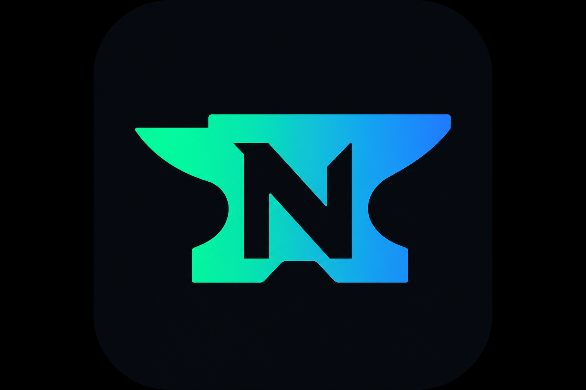

<p align="center">
  
</p>

# Nanvil

Nanvil is a Neo3 local development node inspired by [Foundry Anvil](https://getfoundry.sh/anvil/). It is built on the [neo-go](https://github.com/nspcc-dev/neo-go) blockchain core, with a dev-node layer for instant local chains, prefunded accounts, mainnet/testnet forking, and Anvil-style RPC cheats.

**Website:** [merl111.github.io/nanvil](https://merl111.github.io/nanvil/) — landing page and documentation (also served in the block explorer at `:8546/docs/`).

## Features

- **Local chain** — single-validator in-memory Neo3 network (`NANV` magic), auto-mines on submitted transactions
- **Prefunded dev accounts** — configurable count, mnemonic, and GAS balance; printed on startup
- **Block explorer** — web UI on port `8546` by default (proxies JSON-RPC); disable with `--no-explorer`
- **Mainnet / testnet forks** — lazy StateService fork at any block height; local writes against real remote state
- **Impersonation** — bypass `CheckWitness` for dev signers; **on by default for forks**
- **Dev RPC** — `nanvil_mine`, `nanvil_increaseTime`, snapshots, mempool control, `nanvil_nodeInfo`, and `evm_*` aliases
- **State persistence** — `--data-dir` saves full chain state on shutdown and restores on restart
- **ncast** — cast-style CLI for balances, transfers, contract calls, and deploys
- **nsmith** — multi-language contract compiler (Go, Python, Java, C#) for NEF + manifest artifacts

## Quick start

Download the latest release for your platform from **[GitHub Releases](https://github.com/merl111/nanvil/releases/latest)**, extract it, and start a node:

```bash
./nanvil start
```

Or build from source:

```bash
make build
./bin/nanvil start
```

Builds `nanvil`, `ncast`, and `nsmith` into `./bin/`.

This starts:

| Service | Default URL |
|---------|-------------|
| JSON-RPC | `http://127.0.0.1:8545` |
| Block explorer | `http://127.0.0.1:8546` |
| Documentation (in explorer) | `http://127.0.0.1:8546/docs/` |

Default mnemonic (10 accounts, 10,000 GAS each):

```
test test test test test test test test test test test junk
```

Account keys and addresses are printed to the terminal on startup. Query them anytime:

```bash
curl -s http://127.0.0.1:8545 -H 'Content-Type: application/json' \
  -d '{"jsonrpc":"2.0","id":1,"method":"nanvil_nodeInfo","params":[]}'
```

## Fork mainnet / testnet

```bash
# Create fork manifest
./bin/nanvil fork create --rpc-url http://seed1t5.neo.org:20332 --block 5000000 --out fork.json

# Start forked node (auto-impersonation enabled by default)
./bin/nanvil start --fork-url http://seed1t5.neo.org:20332 --fork-block-number 5000000

# Persist deploys and local state across restarts
./bin/nanvil start --data-dir ./nanvil-data --fork-url http://seed1.neo.org:10332
```

Remote RPC must expose StateService with `FullState=true` (e.g. `seed1.neo.org:10332`, `seed1t5.neo.org:20332`).

Prefetch contract storage to avoid first-call latency:

```bash
./bin/nanvil fork prefetch --manifest fork.json --contract 0x<hash>
```

## ncast

`ncast` talks to a running nanvil node (or any compatible Neo RPC):

```bash
export NCAST_RPC=http://127.0.0.1:8545

./bin/ncast balance <address>
./bin/ncast send --wif <wif> <to> 1
./bin/ncast call gas decimals
./bin/ncast deploy --wif <wif> --nef contract.nef --manifest contract.manifest.json
```

See [examples cookbook](docs/examples.md) for more workflows, including multi-language contract compilation with `nsmith`.

## nsmith

Compile Neo smart contracts in **Go**, **Python**, **C#**, or **Java**:

```bash
./bin/nsmith compile integration/testcontracts/examples/go --out /tmp/example
./scripts/test-nsmith-examples.sh   # all four languages
./bin/nsmith doctor --all           # check toolchains
```

See [nsmith compiler](docs/nsmith.md) for install, `init`, and language-specific setup.

## Useful flags

```bash
# Mine on a fixed interval instead of on every tx
./bin/nanvil start --block-time 1s

# Disable auto-mining entirely
./bin/nanvil start --no-mining

# Disable explorer
./bin/nanvil start --no-explorer

# Disable fork auto-impersonation
./bin/nanvil start --fork-url http://seed1.neo.org:10332 --auto-impersonate=false
```

## Documentation

Browse docs in the explorer at `http://127.0.0.1:8546/docs/` while a node is running, or read the markdown files in `docs/`:

- [Overview](docs/index.md)
- [Getting started](docs/getting-started.md)
- [Examples cookbook](docs/examples.md)
- [CLI reference](docs/cli-reference.md)
- [nsmith compiler](docs/nsmith.md)
- [RPC reference](docs/rpc-reference.md)
- [Block explorer](docs/explorer.md)
- [Forking](docs/forking.md)
- [Impersonation](docs/impersonation.md)
- [State management](docs/state-management.md)
- [Tracing](docs/tracing.md)
- [Architecture](docs/architecture.md)
- [Anvil comparison](docs/anvil-comparison.md)
- [Development](docs/development.md)
- [Upstream sync](docs/upstream-sync.md)

After editing docs, run `make sync-docs` (included in `make build`) to refresh the embedded copy served by the explorer.

## License

Apache 2.0
